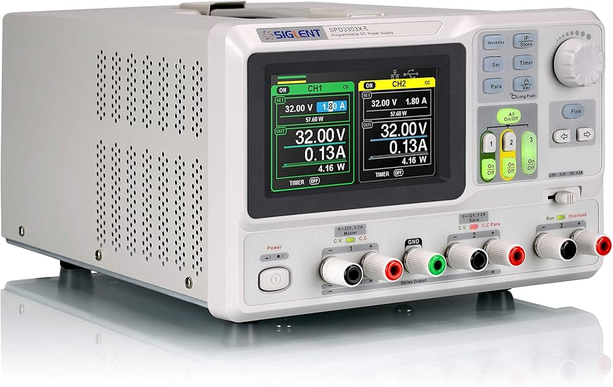
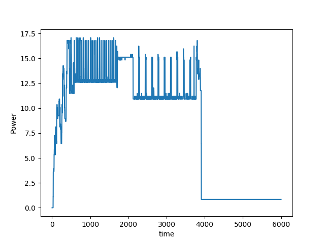

# Siglent PyVISA Example 

A script to using the PyVISA package to log voltage/current values on a Siglent power supply. Saves a CSV file and plots. 



## Usage
```bash
python3 -m pip install -r requirements.txt

python3 siglent_logger.py
```

## Find Resource String
Once you connect over USB or Ethernet to the host PC, query your instrument's unique resource ID.

```python
>>> import pyvisa
>>> rm = pyvisa.ResourceManager()
>>> rm.list_resources()
```

## Output

Example of a power plot you'd get. 



